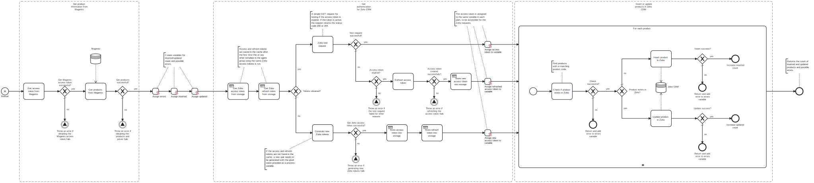

This template process retrieves product data from Adobe Commerce / Magento and either inserts or updates each product in Zoho CRM.

# Prerequisites

This template assumes that the following prerequisites are in place:

- The Magento user is eligible to obtain an access token from Magento.
- The Zoho CRM client ID and client secret are accessible.
- The domain for the Zoho instance (e.g. EU or USA) is identified.
- A Zoho CRM refresh token with an adequate scope has been generated using the "Zoho CRM - Exchange grant token for refresh token" template. For this template, the token should be configured with the scopes `ZohoCRM.modules.products.READ` and `ZohoCRM.modules.products.CREATE`.

# Implementation and Usage Notes

Before retrieving the Magento product data, an access token used for authorizing the request is obtained from the Magento API. 

Accessing the Zoho CRM API also requires an access token, which is obtained with a separate refresh token provided in the process variables. To generate this refresh token, you can use the corresponding "Zoho CRM - Exchange grant token for refresh token" template.

Zoho CRM has separate API domains for different geographical areas, and requests need to be sent to the same domain as the instance. The domain URLs can be set in the process variables.

Each product is either inserted or updated in Zoho CRM, depending on whether a product with a matching product code is found. When inserted in Zoho CRM, the product code is set with the prefix "MAG", followed with the product's Magento ID. 

In this template, Zoho products are created with a minimum set of required attributes. You can adjust the attribute mapping in the settings of the insert and update tasks.

# Error Handling

This template does not handle transient errors separately. Each request to Magento and Zoho CRM is checked for errors. If uploading an individual product fails, the process moves on to the next one, and an error notification specifying the Magento product ID is added to the result message.
