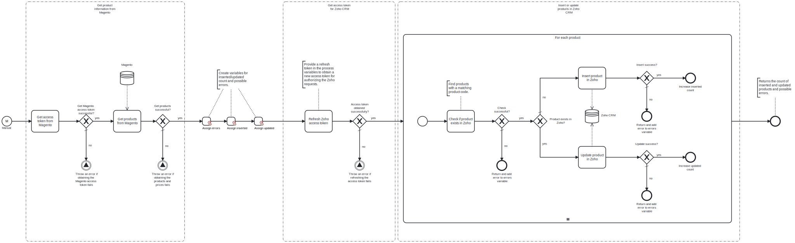

This template process retrieves products from Magento and either inserts or updates them in Zoho CRM.

# Prerequisites

This template assumes that the following prerequisites are in place:

- The Magento user is eligible to obtain an access token from Magento.
- The Zoho CRM client ID and client secret are accessible.
- The domain for the Zoho instance (e.g. EU or USA) is identified.
- A Zoho CRM grant token with an adequate scope has been generated via the Zoho API Console. For this template, the token should be configured with the scopes `ZohoCRM.modules.products.READ` and `ZohoCRM.modules.products.CREATE`.

# Implementation and Usage Notes

Before retrieving the Magento product data, an access token for authenticating the request is obtained from the Magento API. Each product is either inserted or updated in Zoho CRM, depending on whether a product with a matching product code is found. When inserted in Zoho CRM, the product code is set with the prefix "MAG", followed with the product's Magento ID.

Authenticating Zoho CRM API requests requires a set of tokens. A single-use grant token is needed to generate access and refresh tokens for the first time this template, or any other process in the agent group using the same tokens, is run. Note that if the same tokens are to be used with multiple processes, the grant token should be configured to cover all the required scopes for the needed actions.

Zoho access tokens are active for one hour, but they can be regenerated using the refresh token. This template manages token expiry by storing the access and refresh tokens in a cache, with key identifiers that are set in the process variables. If the tokens are already stored, the template proceeds to check if the access token is still active by performing a test GET request. If it has expired, the refresh token is used to generate a new one, which is again stored in the cache for further use.

If the grant token has already been used with another process and the tokens are already accessible in the cache, the process variable for the grant token can be left empty. By default, the tokens are stored in the cache for 24 hours, after which a new grant token needs to be generated. The lifetime of the cached variables can be adjusted in the shared-state tasks' settings.

Zoho CRM has different API domains for different geographical areas, and requests need to be sent to the same domain as the instance. The domain URLs can be set in the process variables.

# Error Handling

This template does not handle transient errors separately. Each request to Magento and Zoho CRM is checked for errors. If uploading an individual product fails, the process moves on to the next one, and an error notification specifying the Magento product ID is added to the result message.
