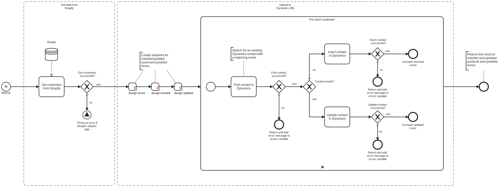

This template retrieves customers from Shopify and either inserts or updates them in Dynamics 365 as contacts.

# Prerequisites

This template assumes that the following prerequisites are in place:

- The Shopify API key is properly configured with the necessary permissions to retrieve data through the API.
- Dynamics 365 user has permissions to insert and update data.

# Implementation and Usage Notes

This template requests customer data from the Shopify API and saves each customer as a contact in Dynamics 365. If a Dynamics contact with a matching email is found, the contact data is updated. Otherwise, the template inserts the customer data as a new contact. The credentials for accessing both APIs are configured with the process variables.

# Error Handling

This template does not handle transient errors separately. Requests to Shopify and Dynamics 365 are checked for errors. If any errors are encountered while processing a single customer, the process continues to the next one, and the error is added to the result message.
