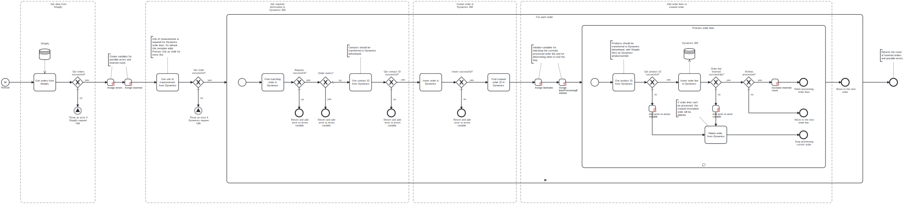

This template retrieves orders from Shopify and inserts them into Dynamics 365.

# Prerequisites

This template assumes that the following prerequisites are in place:

- The Shopify API key is properly configured with the necessary permissions to retrieve data through the API.
- Dynamics 365 user has permissions to insert and update data.
- Shopify customers are already integrated in Dynamics 365 as contacts.
- Shopify products are already integrated in Dynamics 365, with the Dynamics product number matching the Shopify stock keeping unit (SKU).

# Implementation and Usage Notes

This template only handles the insertion of new orders in Dynamics 365. As updating orders is not implemented, the process will ignore any existing order if a matching order name is found, moving to the next one. If this happens, an error specifying the Dynamics order ID is added to the end result.

This template connects the orders to customers and order lines to products by fetching their Dynamics IDs in separate requests. Orders are named with the prefix "Shopify order" followed by the Shopify order number. They are created with the default order state and status. The attributes mapping can be modified by changing the insert order task's payload.

Order lines are created separately after the order is inserted. As creating order lines requires specifying the unit of measurement, this template adds the default Primary Unit as the unit of measurement for every line.

# Error Handling

This template does not handle transient errors separately. Requests to Shopify and Dynamics 365 are checked for errors. If any errors are encountered while handling a single order, the process continues to the next one, and the error message is added to the end result. 

To prevent storing empty orders, the template deletes any order if its order lines cannot be inserted, as part of its error handling.
