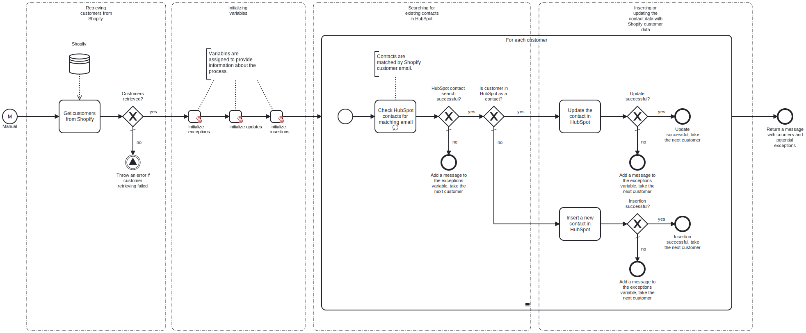

This template exports the customers from Shopify and imports them to HubSpot as contacts.
Using this template, you can insert customer data from Shopify to HubSpot.

# Prerequisites

This template assumes that the following prerequisites are in place:

- Shopify access token is accessible.
- HubSpot user exists for performing the synchronization.
- HubSpot access token is accessible.

# Implementation and Usage Notes

This template uses HTTP requests GET, PATCH and POST to perform operations on both Shopify and HubSpot. GET is used to retrieve customer information from Shopify. POST is used to filter the search data in HubSpot by Shopify customer email and to insert new contact data to HubSpot. PATCH is used to update existing contacts' data with the new information from Shopify.
Other operations are not performed by the template.
Process variables include base urls and access tokens for both Shopify and HubSpot.

# Error Handling

Each task is followed by an error check. If an error occurs while handling a customer, the handling will stop and the next customer will be taken for handling. All encountered errors will be appended to the exception variable and shown at the end of the process.
If transient errors are expected, retries for HubSpot and Shopify connections can be enabled from the tasks. Transient errors are not handled.
