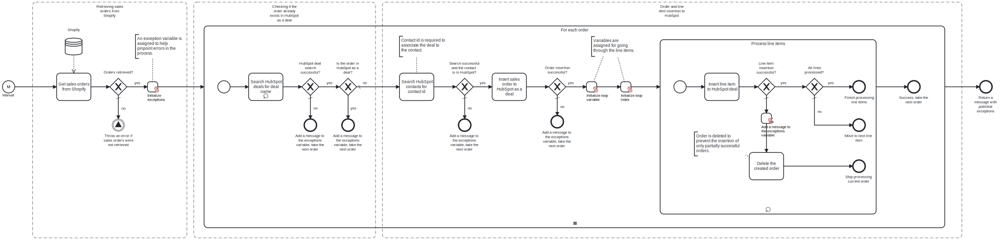

This template exports the orders and line items from Shopify and imports them to HubSpot as deals.

Using this template, you can insert orders and their respective items' data from Shopify to HubSpot.

# Prerequisites

This template assumes that the following prerequisites are in place:

- Shopify access token is accessible.
- HubSpot user exists for performing the synchronization.
- HubSpot access token is accessible.
- The Shopify customer exists in HubSpot as a contact for each new Shopify order. Another template exists to synchronize Shopify customers to HubSpot as contacts.

# Implementation and Usage Notes

This template uses HTTP requests GET, POST and DELETE to perform operations on both Shopify and HubSpot. GET is used to retrieve order information from Shopify and contact information from HubSpot. POST is used to filter the search data in HubSpot by deal name and to insert new deal and line item data to HubSpot. Note that the new deals in HubSpot will be named uniquely with "Shopify_" followed by Shopify order number. DELETE will archive and effectively delete the partially successful order, if an error occurs during line item insertion.

When inserting new deals and line items to HubSpot, new associations are made. Deals are associated to the HubSpot contact, whose email matches with the email linked to the Shopify order. Line items are associated to the new deal by the deal's object id.

Other operations are not performed by the template.

The currency of the deals will be set to the default currency in HubSpot. If you want to set a specific currency, you must first add the currency from your HubSpot settings and then include the currency code in deal and line item insertion.

Process variables include base urls and access tokens for both Shopify and HubSpot.

# Error Handling

Each task is followed by an error check. If an error occurs while handling an order, the handling will stop and the next order will be taken for handling. If an error is encountered when handling a line item, the order is deleted to prevent inserting only partially successful orders and the next order will be taken for handling.

All encountered errors will be appended to the exception variable and shown at the end of the process.

Connection retries and exception throws are turned on by default in searching the HubSpot deals for matching names, because the search API endpoints are rate limited to four requests per second per authentication token.

If any other transient errors are expected, retries can be enabled from the tasks. Transient errors are not handled.
