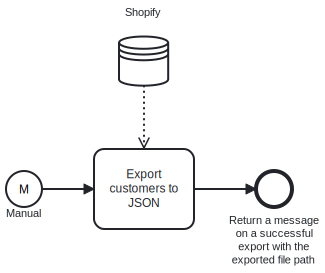

This template exports customers from Shopify and imports them to your local folder.
Using this template, you can export the customers data from Shopify and store it locally.

# Prerequisites

This template assumes that the following prerequisites are in place:

- Shopify admin access token is accessible.
- The folder exists for the export and doesn't have a JSON file with the same name as the exported file.
- Local user has permissions to write and create new files in the selected folder.

# Implementation and Usage Notes

This template downloads the "customers.json" -file from the Shopify API specified in the task input parameter "Url". The exported file path and name can be specified in the process variables.
Process variables include the base url for Shopify, the admin token for Shopify and the local file path for the export.

# Error Handling

Error handling is not implemented in this template.