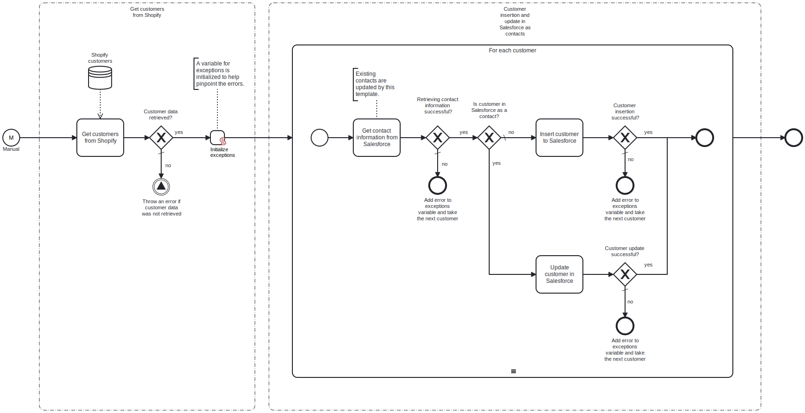

This template synchronizes customers from Shopify to Salesforce as contacts.
Using this template, you can synchronize the list of customers and their names, emails, and addresses from Shopify to Salesforce.

# Prerequisites

This template assumes that the following prerequisites are in place:

- The Shopify user should be eligible to obtain an admin authorization token from Shopify.
- The Salesforce user should have access to client ID, secret and security token.

# Implementation and Usage Notes

This template fetches all the customers from Shopify, and then either inserts or updates them as contacts in Salesforce. To determine if a Shopify customer already has a corresponding contact in Salesforce, the email addresses of the Shopify customers are compared to those of the existing contacts in Salesforce.

Customers that have been deleted from Shopify are not transferred to Salesforce.

Process variables include the credentials and URLs for connecting to both Shopify and Salesforce.

# Error Handling

There is an error check after any tasks regarding Shopify and Salesforce. If an error occurs during customer handling, an error message is added to the exception variable. Then the next contact is taken for handling. All error messages are shown at the end of the process.
Transient errors are not handled separately. Retries for any tasks can be enabled, if transient errors are expected.