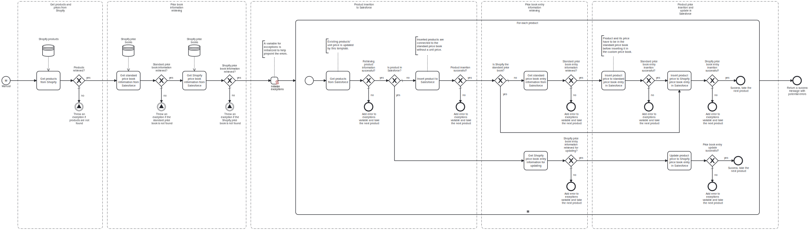

This template inserts and updates Shopify products and their corresponding prices to Salesforce.

Using this template, you can insert your new Shopify products and prices to Salesforce and update existing products' prices.

# Prerequisites

This template assumes that the following prerequisites are in place:

- The Salesforce user should have access to client ID, secret and security token.

- Price book for Shopify is initialized in Salesforce. It is labelled as "Shopify Price Book" in this template.

# Implementation and Usage Notes

This template uses Salesforce queries to identify a product and the price book it's connected to. All products are checked, and if the product exists in Salesforce, the price for that item will be updated in the Shopify price book with latest information from Shopify.

Standard price book status information is retrieved and compared to Shopify price book name. If Shopify is not the standard price book, the product data is inserted into the standard price book first. After that, the Shopify price book information is retrieved for product data handling.

After using this template, the existing products will get their price book entries updated with the new price from Shopify. All new products from Shopify can be found in the Salesforce products. The new products' prices can be found in the Salesforce price book called "Shopify Price Book" as new price book entries. If the "Shopify Price Book" isn't the standard price book, the prices can be found also in the standard price book.

The price book, in which the product price is inserted or updated, can be changed by altering the name in the price book task parameters.

Process variables include fields for both Salesforce and Shopify credentials.

# Error Handling

There is an error check after every task. If an error occurs during product handling, an error message is added to the exceptions variable, and the next product is taken for handling. When the process ends, error messages from related tasks and products are listed.

Transient errors are not handled. If they are expected, retries for connections with Shopify and Salesforce can be enabled from the tasks.