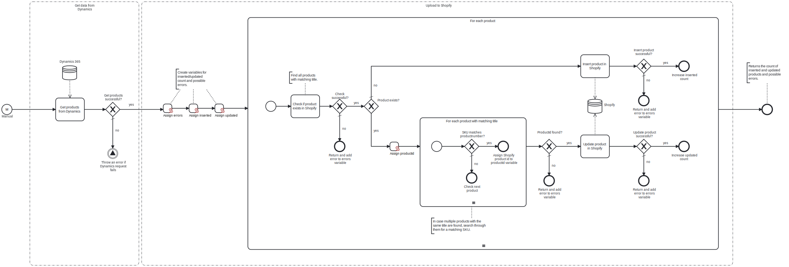

This template retrieves products and their prices from the specified Dynamics 365 instance, and either inserts or updates each product in the designated Shopify store after mapping them to a compatible format.

# Prerequisites

This template assumes that the following prerequisites are in place:

- Dynamics 365 user has permissions to retrieve data through the API. 
- Shopify user has an access token with permissions to insert and update products via the API.

# Implementation and Usage Notes

The template either inserts or updates products in Shopify, depending on whether any products with the same title are found. As the title is not necessarily unique, the process then checks for a matching Shopify stock keeping unit (SKU). This approach is used because the API does not support direct searches using the SKU.

The template does not consider different product categories or variants. It inserts a new product with a single variant, assigning the Dynamics product number as the SKU.

Any discounts, taxes, and additional charges are excluded from the template.

# Error Handling

This template does not handle transient errors separately. Requests to Dynamics 365 and Shopify are checked for errors. If uploading an individual product fails, the process moves on to the next one, and an error notification specifying the product SKU is added to the result message.
