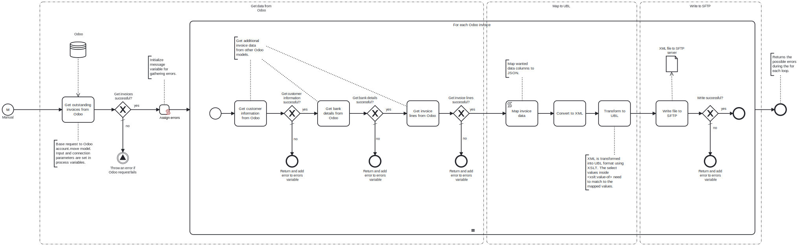

This template retrieves outstanding invoices from Odoo, transforms them into UBL standard XML format, and uploads the resulting XML files to an SFTP server.

# Prerequisites

This template assumes that the following prerequisites are in place:

- The Odoo user has permissions to access data through the API.
- The SFTP user has write permissions to upload files.

# Implementation and Usage Notes

The template makes a request for base invoice data located in Odoo's account.move model, as well as additional requests for supplementary data (e.g. customer information, banking details, and invoice lines) in other models. The data is mapped and converted to XML, which is transformed into UBL format using XSLT. Each file is then written to the SFTP server. If the file already exists in the directory, it will be overwritten. This can be changed in the SFTP Write task's settings.

The template can be customized depending on which data is needed for UBL invoices. The base request's arguments, fields and result limit can be adjusted through process variables, and other additional requests can be added in similar manner as the existing ones. While mapping and transforming the data to UBL, note that the select values in the XMLT need to match the mapped ones.

# Error Handling

This template does not handle transient errors separately. The tasks for Odoo requests and writing to SFTP are checked for errors. If uploading a single invoice fails, the process continues to the next one, and the error is added to the result message.
