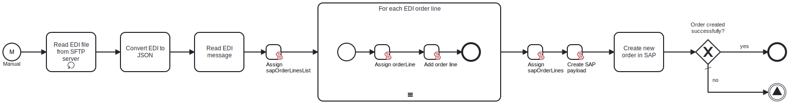

This template reads an EDI D96A order from an SFTP server and sends it to SAP via oData.

# Prerequisites

Ensure the following prerequisites are met before using this template:

- The SFTP user has the necessary permissions to read the required EDI file
- SAP oData is properly configured to receive orders

# Implementation and Usage Notes

This template is a starting point for implementing transferring any sort of an EDI document to SAP and demonstrated the core principle of doing so. In the sample use case we read a EDI with an order and map it to SAP JSON format for sending over to SAP.

Note that SAP oData interface is a powerful API and can be used for a wide variety of integration scenarios, so to get the full benefit of this template it is recommended to edit the data mapping from EDI to SAP, so that it is aligned with the EDI contects and the SAP data model for a concrete SAP installation.

The template does not map all the fields that can potentially be mapped in such a scenario and provides a starting point for customization.

This template serves as a foundational example for transferring any EDI document to SAP and demonstrates the core principles involved. In the provided use case, the template reads an EDI order and maps it to the SAP JSON format before transmitting it to SAP.

Keep in mind:

- The SAP oData interface is a robust API suitable for a wide range of integration scenarios. To fully leverage this template, modify the data mapping from EDI to SAP so that it aligns with the specific EDI content and the SAP data model for your SAP installation.
- This template offers a starting point and does not map all possible fields. Customization is necessary to accommodate the unique requirements of your scenario.

# Error Handling

This template does not handle transient errors separately. 

If SAP call returns anything else than 201 error the process will finish execution with an error.