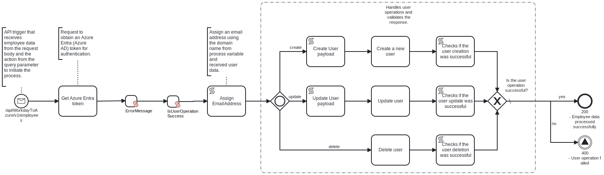

This template process receives an HTTP request containing a simulated Workday employee payload and an action query parameter (e.g. create, update, or delete). 
Based on this input, it processes and sends a corresponding request to Azure Entra ID (formerly Azure Active Directory) to manage the user lifecycle accordingly.



# Prerequisites

This template assumes that the following prerequisites are in place:

- A valid Azure Entra ID application registration exists with permissions to manage users via Microsoft Graph API.

# Implementation and Usage Notes

This process is triggered by an HTTP request containing a simulated Workday employee payload and an action query parameter, which defines whether to create, update, or delete a user. After receiving the request, the process retrieves an Azure access token and converts the incoming data into the correct format for Azure Entra ID, depending on the requested action.

The formatted data is then sent to the appropriate Microsoft Graph API endpoint to perform the user operation. After Azure responds, the process checks if the action was successful. If it was, it returns a 200 OK with the message "User processing successful"; otherwise, it returns a 400 with "User operation failed".

By default, the HTTP trigger is set to use API key, which must be included in the request headers.

# Example HTTP request URL**

`https://myfrendsagent.frendsapp.com/api/WorkdayToAzure/v1/employees?action=update

# Example Body value**

```
{
	"Data": {
		"Employee": {
			"Employee_Data": {
				"Personal_Info_Data": {
					"Person_Data": {
						"Name_Data": {
							"First_Name": "John",
							"Last_Name": "Logan"
						},
						"Contact_Data": {
							"City": "Hamilton",
							"State": "Ohio"
						}
					}
				},
				"Worker_Position_Data": {
					"Employee_ID": "5"
				}
			}
		}
	}
}
```

# Error Handling

If an unknown action is provided or the Azure request fails, the process responds as a 400 status with message: "User operation failed

This template does not handle transient errors separately
