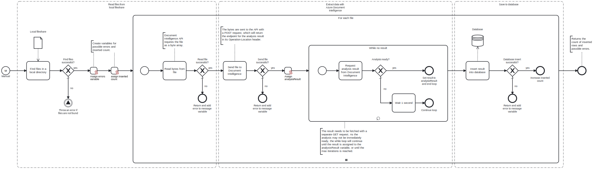

This template reads files from a local fileshare, extracts data from them with Azure Document Intelligence, and inserts them into a Microsoft SQL database table.

# Prerequisites

This template assumes that the following prerequisites are in place:

- The Frends agent has access to the local directory containing the files.
- The Azure user has the required API key and endpoint URL to use the Document Intelligence API.
- The Microsoft SQL user has access to the database with permissions to perform the insert.
- The database table where the results will be saved needs to be created beforehand.

# Implementation and Usage Notes

This template processes each file by reading it as a byte array and sending it to the Document Intelligence API. Different file types should be processed in separate runs, since the document processing model and media type must be specified for each analysis request. These can be configured with process variables.

Extraction results are fetched with a separate API call. As the extraction may not be immediately ready, the process will request the results once per second until the analysis is complete, or until the maximum number of iterations is reached. The maximum iterations can be adjusted in the settings of the while loop.

The template inserts the extracted data into the specified database table in JSON format. Each inserted row contains two columns: the file name, and the analysis result as JSON data type. Additional mapping can be implemented in the process to customize how the results are stored in the database.

# Error Handling

This template does not handle transient errors separately. Processing each file is checked for errors during reading, sending to the API, and inserting to database, and any encountered errors are displayed at the end of the process.
