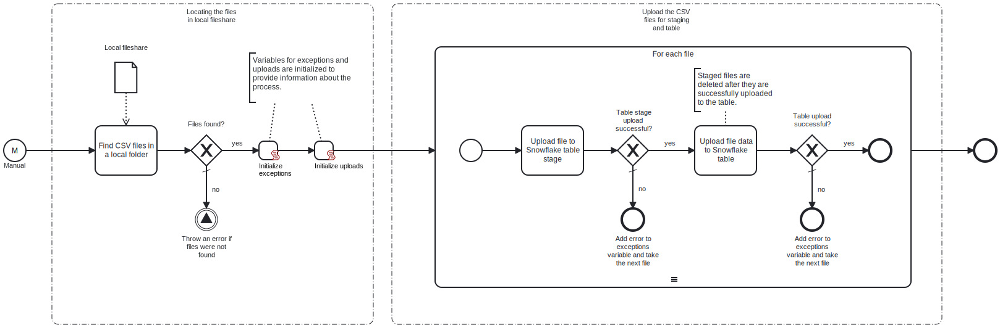

This template uploads local CSV files to a staging area within Snowflake. After staging, the file content is moved to the Snowflake table.
Using this template, you can insert any kind of data from your CSV files to the Snowflake table.

# Prerequisites

This template assumes that the following prerequisites are in place:

- Database, schema and table exist in Snowflake for performing the synchronization.
- The CSV file content is in the same structure as the Snowflake table columns.
- If there are multiple CSV files in the local folder, all of the files should be in the same structure.

# Implementation and Usage Notes

This template uses Snowflake queries also known as SnowSQL, which upload CSV files for staging and to the Snowflake table. The stage used by this template is the table's.
If your CSV files have quotation marks between values, leading spaces, other field delimiters than comma or other such properties, the command line in the task which uploads the files to the Snowflake table can be modified with more optional parameters.
Every staged file will be deleted from the table stage after a successful upload to the Snowflake table. If you want to keep the file in the table stage after uploading it, the command line in the task which uploads the files to the Snowflake table should be modified by removing the optional parameter called "PURGE".
Process variables include path name to the local folder, the Snowflake table name and the connection string for Snowflake.

# Error Handling

Each task is followed by an error check. If an error occurs during a Snowflake upload, the upload will stop and the next file will be taken for handling. Any errors encountered will be noted at the end of the process.
If transient errors are expected, retries for Snowflake uploads can be enabled from the tasks. Transient errors are not handled.