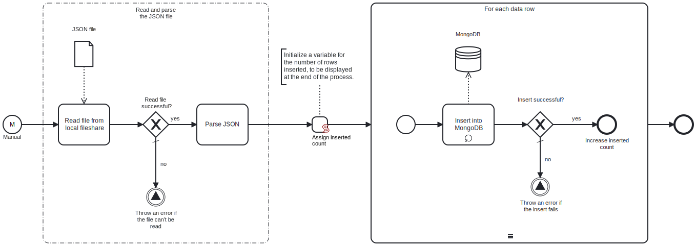

This template reads a JSON file from a local fileshare and inserts its contents into a MongoDB collection.



# Prerequisites

This template assumes that the following prerequisites are in place:

- The Frends agent has access to the local fileshare containing the JSON file.
- The MongoDB user has access to the database with the necessary permissions to perform the insert.

# Implementation and Usage Notes

This template inserts each data object into a MongoDB collection as a separate row. The template only handles the insertion of new data, and it does not perform checks for existing rows in the collection.

The path to the file in the local fileshare, as well as the target MongoDB database and collection, are determined within the process variables. If the specified database or collection does not already exist, they will be created automatically.

**Example JSON data structure**

```json
[
    {
        "name": "John Doe",
        "email": "john.doe@example.com",
        "age": 29,
        "address": {
            "street": "123 Main St",
            "city": "Springfield",
            "state": "IL",
            "zip": "62701"
        },
        "interests": ["reading", "gaming", "hiking"]
    },
    {
        "name": "Jane Smith",
        "email": "jane.smith@example.com",
        "age": 34,
        "address": {
            "street": "456 Elm St",
            "city": "Springfield",
            "state": "IL",
            "zip": "62702"
        },
        "interests": ["cooking", "traveling", "swimming"]
    }
]
```

# Error Handling

If the file cannot be read, the process throws an exception. If inserting a row fails, the process throws an exception. The template does not handle transient errors separately, however the connection to MongoDB is tried 3 times before failing.
