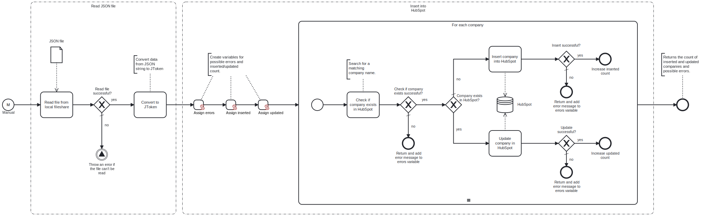

This template reads a JSON file containing company data from a local fileshare, and either inserts or updates each company in HubSpot.



# Prerequisites

This template assumes that the following prerequisites are in place:

- The Frends agent has access to the local fileshare containing the JSON file.
- Using the HubSpot API requires an API key.

# Implementation and Usage Notes

This template either inserts or updates each company in HubSpot, depending on whether a company with a matching name is found. To use the template without modifications, ensure the JSON data for each company matches the format required for creating companies via the API. If the data format does not match, the template can be adjusted to include additional mapping.

**Example JSON data structure**
```
[
    {
        "properties": {
            "name": "Example Company",
            "domain": "https://www.examplecompany.com",
            "address": "123 Lane Road",
            "city": "Los Angeles",
            "zip": "10001",
            "state": "CA",
            "country": "United States",
            "phone": "555-123-4567"
        }, 
    },
    {
        "properties": {
            "name": "Another Company",
            "domain": "https://www.anothercomp.org",
            "phone": "555-321-7654"
        }, 
    }
]
```

# Error Handling

If the file cannot be read, the process throws an exception. The API calls to HubSpot are checked for errors. If processing a company fails, the template moves to the next one, and any encountered errors are displayed at the end of the process. This template does not handle transient errors separately. However, if transient errors are expected, you can enable the "Retry on Failure" option in the advanced settings of the HubSpot request tasks.
