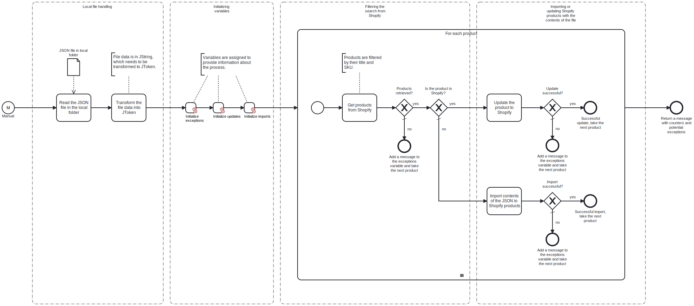

This template reads products from a local JSON file and imports them to Shopify.
Using this template, you can import your local JSON product data to Shopify.



# Prerequisites

This template assumes that the following prerequisites are in place:

- Shopify admin token is accessible.
- The local folder containing the JSON file is accessible.

# Implementation and Usage Notes

This template reads the contents of a local JSON file and transforms the resulting JString to JToken. For every product that exists in the JSON file, the template will get the product information from Shopify and match it with the product title and stock keeping unit. If products are found in Shopify, the template will update the records with the contents of the local file. Otherwise the products will be added as new products to Shopify.
Process variables include the full file path to the local JSON file, the base url for Shopify and the admin token for Shopify.

# Example JSON data

```json
{
    "product": [
        {
            "title": "New product",
            "body_html": "New product information",
            "variants": [
                {
                "sku": "NP1",
                "price": "0.99",
                "inventory_quantity": "100"
                }
            ]
        },
        {
            "title": "New product 2",
            "body_html": "Another new product information",
            "variants": [
                {
                "sku": "NP2",
                "price": "1.99",
                "inventory_quantity": "50"
                }
            ]
        }
    ]
}
```

# Error Handling

The product handling tasks are followed by error checks. If an error occurs while handling a product, the handling for that product will stop and the next product will be taken for handling. Any exceptions encountered will be shown at the end of the process along with the counters for successful imports and updates.
If transient errors are expected, retries for connections to Shopify can be enabled from the tasks. Transient errors are not handled.
