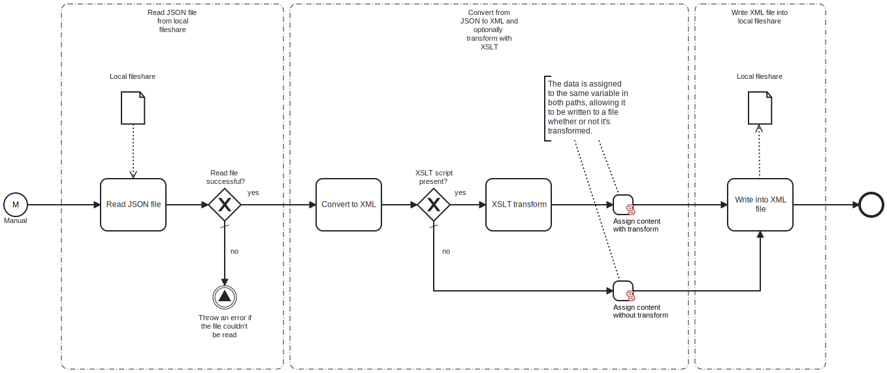

This template converts a JSON file from a local fileshare into XML, optionally transforms it using an XSLT stylesheet, and saves it locally as an XML file.



# Prerequisites

This template assumes that the following prerequisites are in place:

- The Frends agent has access to the local directory containing the JSON file.
- The Frends agent has access to the local directory to which the resulting XML file will be saved.
- If the file needs to be transformed using an XSLT stylesheet, the stylesheet must be created separately and provided as a process variable.

# Implementation and Usage Notes

The full paths for both the JSON file and the resulting XML file are specified within the process variables. If an XML file with the same name already exists, it will be overwritten. This behavior can be adjusted in the write task's settings.

If the converted XML needs to be transformed using an XSLT stylesheet, you can provide an XSLT script as a process variable. If this variable is left empty, the process will skip the transformation and will only convert the JSON to XML before saving the file.

**Example JSON data structure**

```json
{
    "company": {
        "name": "Big Corporation",
        "employees": [
            {
                "id": 101,
                "name": "Jane Doe",
                "position": "Software Engineer",
                "skills": ["C#", "Python", "Java"]
            },
            {
                "id": 102,
                "name": "John Smith",
                "position": "Product Manager",
                "skills": ["Agile", "Scrum"]
            }
        ],
        "founded": 2011,
        "isPublic": true
    }
}
```

**Example XSLT stylesheet**

```json
<?xml version="1.0" encoding="UTF-8"?>
<xsl:stylesheet version="1.0" xmlns:xsl="http://www.w3.org/1999/XSL/Transform">
  <xsl:output method="html" indent="yes"/>

  <xsl:template match="/">
    <html>
      <head>
        <title>Company Information</title>
      </head>
      <body>
        <h1><xsl:value-of select="company/name"/></h1>
        <h2>Employees</h2>
        <ul>
          <xsl:for-each select="company/employees">
            <li>
              <strong>ID:</strong> <xsl:value-of select="id"/> <br/>
              <strong>Name:</strong> <xsl:value-of select="name"/> <br/>
              <strong>Position:</strong> <xsl:value-of select="position"/> <br/>
              <strong>Skills:</strong>
              <ul>
                <xsl:for-each select="skills">
                  <li><xsl:value-of select="."/></li>
                </xsl:for-each>
              </ul>
            </li>
          </xsl:for-each>
        </ul>

        <h2>Company Details</h2>
        <p><strong>Founded:</strong> <xsl:value-of select="company/founded"/></p>
        <p><strong>Public:</strong> <xsl:value-of select="company/isPublic"/></p>
      </body>
    </html>
  </xsl:template>
</xsl:stylesheet>

```

# Error Handling

If the JSON file cannot be read, the process throws an error. Otherwise, the template does not include error handling, so any task failure results in an exception.
