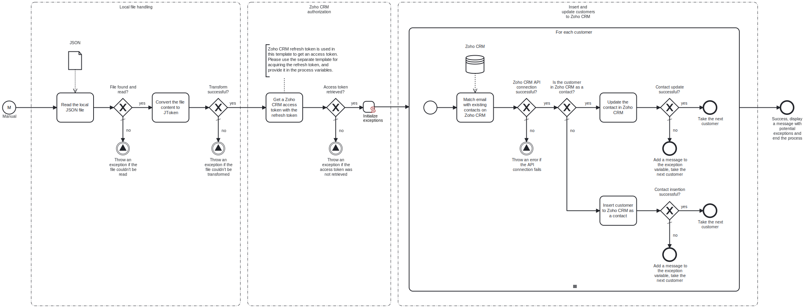

This template reads a JSON file containing customer data from a local fileshare and either inserts or updates each customer in Zoho CRM as contacts.



# Prerequisites

This template assumes that the following prerequisites are in place:

- The Frends agent has access to the local fileshare containing the JSON file.
- The Zoho CRM refresh token has been generated and provided in the process variables. A refresh token can be created using the corresponding template.

# Implementation and Usage Notes

This template requires a refresh token for the Zoho API in order to work. The template will use the refresh token to create the access token for accessing the API. The refresh token can be created using the "Zoho CRM - Exchange grant token for refresh token" template.

The path to the JSON file in the local fileshare is determined in the process variables. The template either inserts or updates each customer in Zoho CRM contacts, depending on whether or not a matching email address is found in an existing contact on Zoho CRM. 

To use the template without modifications, ensure the JSON data matches the format required for creating contacts via the API. If the data format does not match, the template can be adjusted to include additional mapping.

The process variables include the file path for the local JSON file, Zoho CRM API and account URLs, Zoho CRM client ID and client secret, and the Zoho CRM refresh token.

**Example JSON data structure**

```json
{
    "customers": [
      {
        "id": 1,
        "firstname": "John",
        "lastname": "Doe",
        "email": "john@doe.com",
        "phone": "+1234567890",
        "address": {
          "street": "123 Elm Street",
          "city": "Springfield",
          "state": "IL",
          "postalCode": "62701",
          "country": "USA"
        }
      },
      {
        "id": 2,
        "firstname": "Jane",
        "lastname": "Smith",
        "email": "jane.smith@nonexistent.com",
        "phone": "+0987654321",
        "address": {
          "street": "456 Oak Avenue",
          "city": "Metropolis",
          "state": "NY",
          "postalCode": "10001",
          "country": "USA"
        }
      }
    ]
  }
```

# Error Handling

There is an error check after every task in the template. If an error occurs during customer data insertion or updating, an error message is appended to the exceptions variable. These exceptions are printed at the end of the process. Other exceptions will halt the process.

Transient errors are not handled. If they are expected, retries can be enabled in the task settings.
