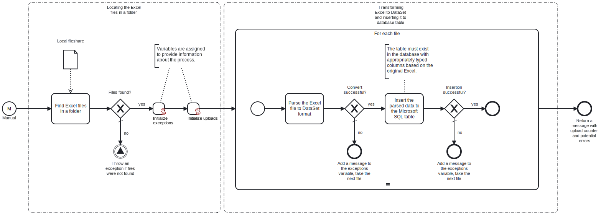

This template parses your local Excel files and imports them to your Microsoft SQL database table.

Using this template, you can insert any kind of data from your Excel files to the Microsoft SQL table.



# Prerequisites

This template assumes that the following prerequisites are in place:

- Microsoft SQL table exists for performing the synchronization.
- Microsoft SQL connection string is accessible.
- The Excel file content is in the same structure as the database table columns.
- If there are multiple Excel files in the local folder, all files should be in the same structure.

# Implementation and Usage Notes

This template will locate Excel files in the local folder provided in the process variable. Each file is then parsed to a DataSet. DataSet table contents are transformed to a JSON string and inserted to the Microsoft SQL table. The local Excel files are not manipulated in any way by this template.

Excel files should not include headers - only the data to be inserted is required. The Excel file should be structured in the same way as the database or vice versa.

Process variables include the path name to the local folder, the Microsoft SQL table name and the connection string for Microsoft SQL.

**Example database table and Excel structure**

```sql
CREATE TABLE CustomerFeedback (
    [Date] DATE,
    [CustomerName] VARCHAR(255),
    [Product] VARCHAR(255),
    [Rating] FLOAT,
    [Comments] TEXT,
    [FollowUpRequired] VARCHAR(3)
);
```

```plaintext
11.7.2024 Daniel Matthews    Cafe Corto         5       So delicious!               no
11.7.2024 Kate Thompson      Blueberry muffin   4.5     Yummy! Just a bit dry.      no
12.7.2024 Matthew Daniels    Hot cocoa          2       Too hot and bitter.         yes
```

# Error Handling

Each task is followed by an error check. If an error occurs when handling a file, that file's data won't be uploaded and the next file will be taken for handling. Any errors encountered will be noted at the end of the process.

If transient errors are expected, retries can be enabled from the tasks. Transient errors are not handled.