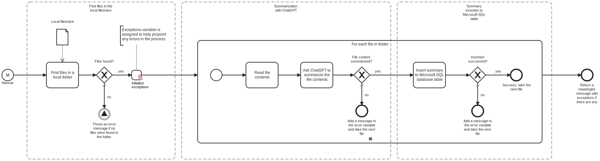

This template will read a local folder's content(s) and ask ChatGPT to summarize the file(s). The summary is then inserted to a Microsoft SQL database table.
Using this template, you can summarize your folder's content and store the summary into your Microsoft SQL database table.

# Prerequisites

This template assumes that the following prerequisites are in place:

- A Microsoft SQL database and a database table with appropriate columns exist for inserting the summary.
- ChatGPT API key is accessible.

# Implementation and Usage Notes

This template finds a local folder and checks the folder for files. For each file in the local folder, the file content is read and submitted to ChatGPT with a prompt to summarize the file content. Then the summary is inserted to the Microsoft SQL database table with an SQL query. The database should contain columns for at least the file name, the date and time the summary is input to the table, and the summary itself.
Other database queries, such as deleting and updating the entries, are not utilized by this template.
Process variables include the local folder path, ChatGPT API key, ChatGPT model you're using, ChatGPT chat prompt for starting the summarization, the connection string to Microsoft SQL database and the database table name.

# Error Handling

Most tasks are followed by an error check. If an error occurs during summarization or database insertion, the handling will stop for that file and the next file be taken for summarization. An error message is added to the exceptions variable. Any exceptions encountered will be shown at the end of the process.
If transient errors are expected, retries for Microsoft SQL database and ChatGPT connections can be enabled from the tasks. Transient errors are not handled.