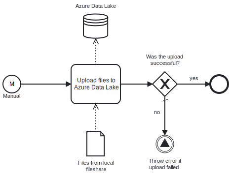

This Process uploads files from a **local filesystem** based on a **file mask** and a **source path** to **Azure Data Lake**.

# Prerequisites

This template assumes that the following prerequisites are in place:

- The Frends agent has access to the local files that need to be uploaded.
- The Azure user has the permission to upload files to the Data Lake.

# Implementation and Usage Notes

This template uploads files from the local fileshare or file system to Azure Data Lake.

The source and destination paths, the pattern for matching source files, and parameters for connecting to the Data Lake container are passed to the template using Process Variables.

The template does not handle cleanup of the local directory, so cleaning or local file processing should be configured separately.

By default, the Azure Data Lake upload task overwrites any existing files in the target directory if they have same names as the files to be uploaded. This behavior can be changed in the task options.

# Error Handling

This template does not handle transient errors separately.
