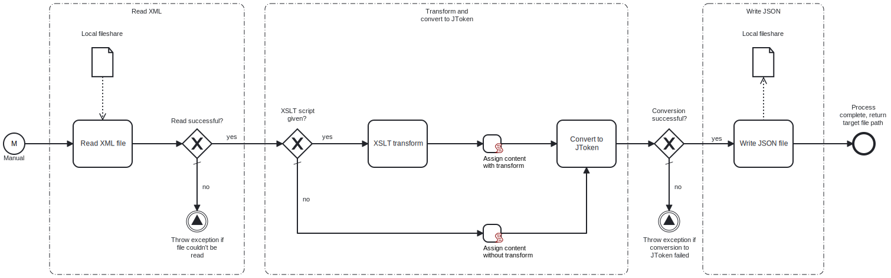

This template reads an XML file from the local fileshare, optionally transforms it using an XSLT stylesheet, converts the data into JSON and saves it locally as a JSON file.



# Prerequisites

This template assumes that the following prerequisites are in place:

- The Frends agent has access to the local directory containing the XML file.
- The Frends agent has access to the local directory to which the resulting JSON file will be saved.
- If the file needs to be transformed using an XSLT stylesheet, the stylesheet must be created separately and provided as a process variable.

# Implementation and Usage Notes

The full paths for both the XML file and the resulting JSON file are specified within the process variables. If a JSON file with the same name already exists, it will be overwritten. This behavior can be adjusted in the write task's settings.

If the read XML needs to be transformed using an XSLT stylesheet, you can provide an XSLT script as a process variable. If this variable is left empty, the process will skip the transformation and will only convert the XML to JSON before saving the file. Note that `method="xml"` should be defined in the `<xsl: output/>` tag so that the transformed XML can be converted into JSON properly.

**Example input XML**

```xml
<?xml version="1.0"?>
<company>
	<name>Big Corporation</name>
	<employees>
		<id>101</id>
		<name>Jane Doe</name>
		<position>Software Engineer</position>
		<skills>C#</skills>
		<skills>Python</skills>
		<skills>Java</skills>
	</employees>
	<employees>
		<id>102</id>
		<name>John Smith</name>
		<position>Product Manager</position>
		<skills>Agile</skills>
		<skills>Scrum</skills>
	</employees>
	<founded>2011</founded>
	<isPublic>true</isPublic>
</company>
```

**Example XSLT stylesheet**

```xml
<?xml version="1.0" encoding="UTF-8"?>
<xsl:stylesheet version="1.0" xmlns:xsl="http://www.w3.org/1999/XSL/Transform">
  <xsl:output method="xml" indent="yes"/>

  <xsl:template match="/">
    <html>
      <head>
        <title>Company Information</title>
      </head>
      <body>
        <h1><xsl:value-of select="company/name"/></h1>
        <h2>Employees</h2>
        <ul>
          <xsl:for-each select="company/employees">
            <li>
              <strong>ID:</strong> <xsl:value-of select="id"/> <br/>
              <strong>Name:</strong> <xsl:value-of select="name"/> <br/>
              <strong>Position:</strong> <xsl:value-of select="position"/> <br/>
              <strong>Skills:</strong>
              <ul>
                <xsl:for-each select="skills">
                  <li><xsl:value-of select="."/></li>
                </xsl:for-each>
              </ul>
            </li>
          </xsl:for-each>
        </ul>

        <h2>Company Details</h2>
        <p><strong>Founded:</strong> <xsl:value-of select="company/founded"/></p>
        <p><strong>Public:</strong> <xsl:value-of select="company/isPublic"/></p>
      </body>
    </html>
  </xsl:template>
</xsl:stylesheet>

```

# Error Handling

If the XML file cannot be read, or the XML cannot be converted into JSON, the process throws an error. For the XSLT transform and writing the JSON file, error handling is not implemented separately, so failures during these tasks process will lead to exceptions.
