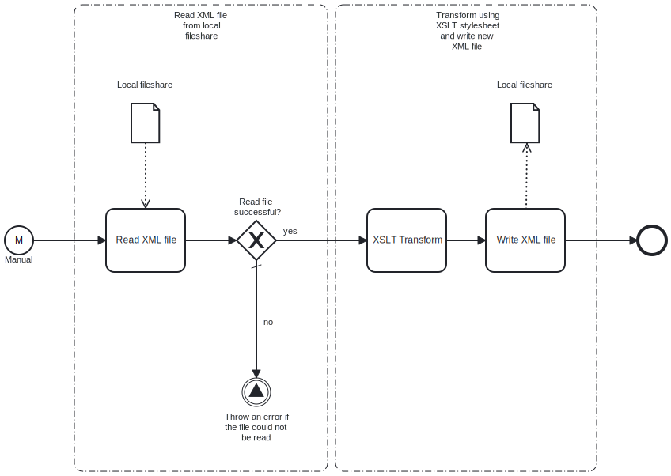

This template reads an XML file from a local fileshare, transforms it using an XSLT stylesheet, and saves the result locally.



# Prerequisites

This template assumes that the following prerequisites are in place:

- The Frends agent has access to the local directory containing the input XML file.
- The Frends agent has access to the local directory to which the output XML file will be saved.
- The XSLT stylesheet for transforming the XML is prepared separately.

# Implementation and Usage Notes

The full paths for both the input and output file are specified within the process variables. If the output file with the same name already exists, it will be overwritten. This behavior can be adjusted in the write task's settings.

An XSLT stylesheet is used to transform the XML. The stylesheet must be created independently and provided as a process variable. The template does not include validation for the XSLT, so ensure that it is correctly designed.

**Example XML data structure**

```xml
<company>
  <name>Big Corporation</name>
  <employees>
    <employee>
      <id>101</id>
      <name>Jane Doe</name>
      <position>Software Engineer</position>
      <skills>
        <skill>C#</skill>
        <skill>Python</skill>
        <skill>Java</skill>
      </skills>
    </employee>
    <employee>
      <id>102</id>
      <name>John Smith</name>
      <position>Product Manager</position>
      <skills>
        <skill>Agile</skill>
        <skill>Scrum</skill>
      </skills>
    </employee>
  </employees>
  <founded>2011</founded>
  <isPublic>true</isPublic>
</company>
```

**Example XSLT stylesheet**

```xml
<?xml version="1.0" encoding="UTF-8"?>
<xsl:stylesheet version="1.0" xmlns:xsl="http://www.w3.org/1999/XSL/Transform">
  <xsl:output method="html" indent="yes"/>

  <xsl:template match="/">
    <html>
      <head>
        <title>Company Information</title>
      </head>
      <body>
        <h1><xsl:value-of select="company/name"/></h1>

        <h2>Employees</h2>
        <ul>
          <xsl:for-each select="company/employees/employee">
            <li>
              <strong>ID:</strong> <xsl:value-of select="id"/> <br/>
              <strong>Name:</strong> <xsl:value-of select="name"/> <br/>
              <strong>Position:</strong> <xsl:value-of select="position"/> <br/>
              <strong>Skills:</strong>
              <ul>
                <xsl:for-each select="skills/skill">
                  <li><xsl:value-of select="."/></li>
                </xsl:for-each>
              </ul>
            </li>
          </xsl:for-each>
        </ul>
        <h2>Company Details</h2>
        <p><strong>Founded:</strong> <xsl:value-of select="company/founded"/></p>
        <p><strong>Public:</strong> <xsl:value-of select="company/isPublic"/></p>
      </body>
    </html>
  </xsl:template>
</xsl:stylesheet>
```

# Error Handling

If the input XML file cannot be read, the process throws an error. Otherwise, the template does not include error handling, so any task failure results in an exception.
