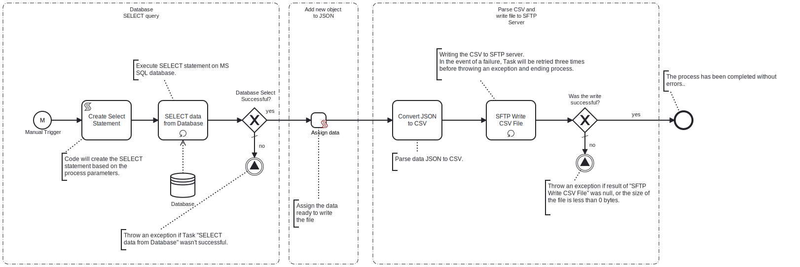

This template generates CSV data from Microsoft SQL Server. 
Using this template, you can create a CSV file by fetching data from Microsoft SQL Server, converting it into JSON, and then transforming it into CSV file which will be saved on SFTP server.

# Prerequisites

This template assumes that the following prerequisites are in place:

- The MS SQL Server user has permissions to read data from the tables specified in the query.
- The SFTP server user should have the permissions to connect and write the files that Frends needs to upload.

# Implementation and Usage Notes

This template creates a new CSV file based on the data from the SQL query. 
The variable SelectionCriteria provides the possibility to add conditions to the SELECT statement.
In case of already existing file in SFTP server path, old file will be overwritten

# Error Handling

Connection to Database and SFTP server is retried three time before failing.
Any other error related to conversion process is not handled by custom exception.
