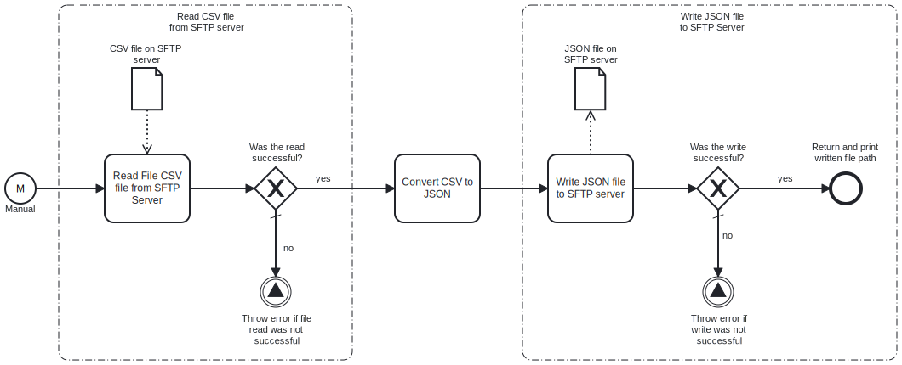

This template process downloads a **CSV** file from an **SFTP server**, converts it to **JSON** format and then writes the result to an SFTP server. The source and target SFTP servers can be different.



# Prerequisites

This template assumes that the following prerequisites are in place:

- The SFTP server user has read and write access to files.
- The file to read and the target directory should exist on the SFTP server.

# Implementation and Usage Notes

This template process creates new a JSON file based on data in the input CSV file and uploads it to an SFTP server. The data is written as is, with each row in the CSV forming one JSON object. If the target JSON file already exists, it will by default be overwritten, but this behavior can be changed to e.g., append the data to the existing file.

The default port used for both the input and target servers is 23. This can be changed in the corresponding tasks.

# Example input and output

```csv
firstname;lastname;email;phone
Foo;Bar;foobar@example.com;010111222
John;Doe;johndoe@example.com;010222333
```

```json
[
    {
        "firstname": "Foo",
        "lastname": "Bar",
        "email": "foobar@example.com",
        "phone": "010111222"
    },
    {
        "firstname": "John",
        "lastname": "Doe",
        "email": "johndoe@example.com",
        "phone": "010222333"
    }
]
```

# Error Handling

This template does not handle transient errors separately.