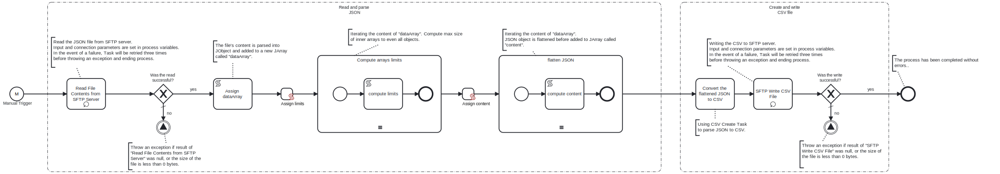

This Process downloads JSON file from an SFTP server, converts it to CSV format and then writes the result back to the SFTP server.

# Prerequisites

This template assumes that the following prerequisites are in place:

- The SFTP server user should have read and write access to files

# Implementation and Usage Notes

This Process creates new a CSV file based on data in the input JSON file. The data is written as is, without any transformations. In case when target CSV file already exists of the SFTP server it will be overwritten.

# Error Handling

Connection to the SFTP server is retried three times before failing. Any other transient errors related to conversion process are not handled and will produce an exception.