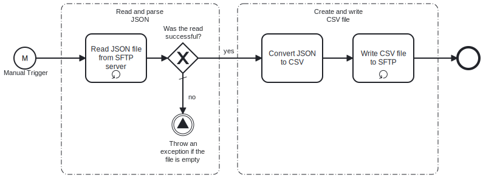

Template enables to convert Json file into Csv file. It reads Json file from source SFTP server and write a new CSV file in a target SFTP server.

# Prerequisites

This template assumes that the following prerequisites are in place:

- The Source SFTP server user should have read access to files
- The Target SFTP server user should have write access to files

# Implementation and Usage Notes

This template create new Csv file based on data provided by Json file. It doesn't make any changes to Json file. In case of already existing file in Target path, old file will be overwritten. If Json contain array of objects, their structure needs to be consistent.

# Error Handling

Connection to both SFTP servers is retried three times before failing. Any other error related to conversion process is not handled by custom exception.
