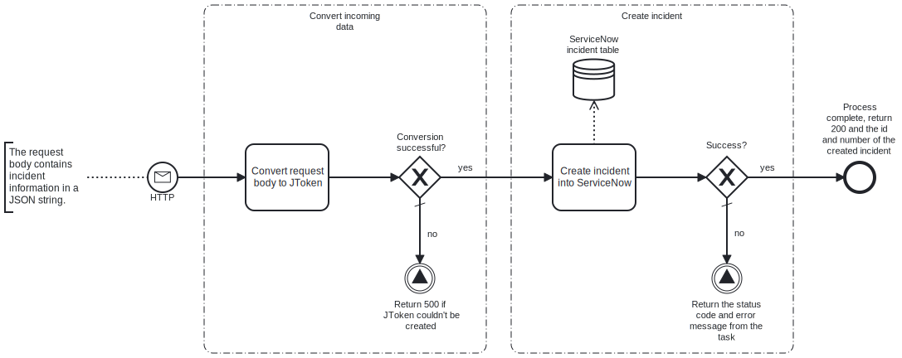

This template process receives an HTTP POST request containing incident information, and creates a corresponding incident in ServiceNow.



# Prerequisites

This template assumes that the following prerequisites are in place:

- The ServiceNow user has the required permissions to create incidents and modify their fields. The default role required for this in ServiceNow is "sn_incident_write".

# Implementation and Usage Notes

This template receives an HTTP POST request, which contains JSON data in its body, and uses the data to create an incident into ServiceNow. On successful completion, the process returns status code 200 and the ID and number of the created incident.

By default, the URL at which this process receives requests is `https://<myfrendsagent>.frendsapp.com<:port>/createServiceNowIncident`. The process has been configured to allow both HTTP and HTTPS protocols and use [API key](https://docs.frends.com/en/articles/2206706-api-keys) authorization. The URL, allowed protocols and authorization method can be changed in the trigger.

Process variables include the credentials for ServiceNow, and the name of the ServiceNow instance.

**Example HTTP request body with supported fields**

```JSON
{
    "impact": 1,
    "urgency": 1,
    "cause": "Unknown",
    "description": "A user is experiencing issues with their AD credentials",
    "short_description": "AD credentials issues",
    "business_impact": "Low business impact, but hinders the user's ability to work.",
    "category": "Azure AD",
    "notify": 2,
    "comments": "A simple password reset is probably required."
}
```

**Example responses on success and failure**

```JSON
{
    "number": "INC00001",
    "id": "abcdefg1234567"
}

{
    "error": "An exception occurred when attempting to create the incident into ServiceNow. HTTP status code: 401"
}
```

# Error Handling

This template checks for errors after each task, and returns status code 500 along with error information if an error occurs.

If transient errors are expected, retries for the creation of the incident in ServiceNow can be configured in the task.