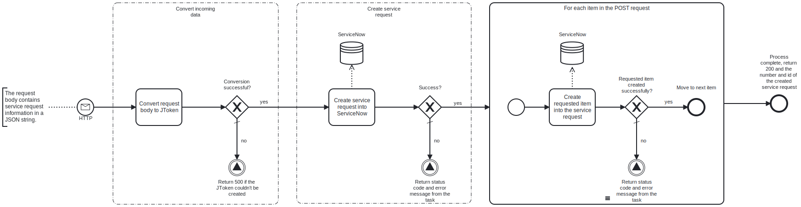

This template process receives an HTTP POST request containing service request information in JSON format, and creates a service request into ServiceNow based on it.



# Prerequisites

This template assumes that the following prerequisites are in place:

- The ServiceNow user has the required permissions to create sercice requests and modify their fields.
  - The default role required for this in ServiceNow is "itil".

# Implementation and Usage Notes

This template receives an HTTP POST request, which contains JSON data in its body, and uses the data to create a service request into ServiceNow. On successful completion, the process returns status code 200 and the ID and number of the created service request.

Service requests on ServiceNow can have requested items attached to them. If you want to attach items to the created request, you can include them in the JSON body as an array called `items`. For this, you need to know the Servicenow sys_id of the catalog items you're attaching, and set a price and quantity for them. If you don't want to insert requested items, `items` should be left empty: [].

By default, the URL at which this process receives requests is `https://<myfrendsagent>.frendsapp.com<:port>/createServiceNowServiceRequest`. The process has been configured to allow both HTTP and HTTPS protocols and use [API key](https://docs.frends.com/en/articles/2206706-api-keys) authorization. The URL, allowed protocols and authorization method can be changed in the trigger.

Process variables include the credentials for ServiceNow, and the name of the ServiceNow instance.

**Example HTTP request body with supported fields**

```JSON
{
    "impact": 2,
    "urgency": 2,
    "priority": 1,
    "delivery_address": "Test Lane 1, 00001 Test",
    "special_instructions": "Handle with care!",
    "short_description": "Deliver components to IT",
    "description": "The IT department requires some PC components for the servers.",
    "comments": "GPUs and coolers.",
    "items": [
        {
            "id": "123456",
            "quantity": 10,
            "price": "599.00"
        },
        {
            "id": "abcdef",
            "quantity": 10,
            "price": "89.00"
        }
    ]
}
```

**Example responses on success and failure**

```JSON
{
    "number": "REQ0010016",
    "id": "a4acea2683eb46100eb2f0ffeeaad3b2"
}

{
    "error": "An exception occurred when attempting to create the service request into ServiceNow. Error message:  User Not Authenticated"
}
```

# Error Handling

This template checks for errors after each task, and returns the status code and error message as an HTTP response to the caller in case errors are encountered.

If transient errors are expected, retries for the creation of the service request and the request items in ServiceNow can be configured in the corresponding tasks.